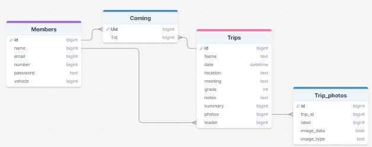
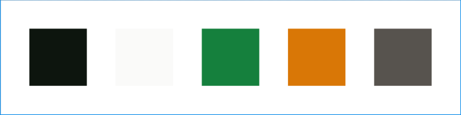

# Sprint 1 - A Working UI Prototype

## Sprint Goals

Develop a prototype that simulates the key functionality of the system, then test and refine it so that it can serve as the model for the next phase of development in Sprint 2.

[Figma](https://www.figma.com/) is used to develop the prototype.

---

## Initial Database Design

this is the initiail design for the databse,

The database consists of five interconnected tables:

 - Members: stores user information.
 - Trips: stores data about organized trips.
 - Coming: a join table indicating which members are attending which trips.
 - Trip_photos: stores photos associated with trips.

### Required Data Input
The system will require input from Admins:

Members Input:
Admins add new user with: name, email, phone number (number), password (hashed), and vehicle ownership.

Trip Creation:
Admins or leaders will create new trips by inputting: trip name, date/time, location, meeting point, grade (difficulty), notes, summary, photos, and leader ID.

Trip Attendance:
Users will be able to join trips, which adds a record to the Coming table linking their id to the trip id.

Photo Upload:
Admins can upload images associated with a trip, storing them in Trip_photos with a label and image data.

### Required Data Output
The system will display several types of information:

Trip Listings:
Upcoming and past trips with date, location, summary, and leader info.

Trip Details Page:
Full trip information including notes, meeting point, and difficulty
List of attending members.
Photo gallery.

Admin page:
Dashboard for managing trips and viewing attendance.
Access to add/edit/delete trips and members and upload photos.

### Required Data Processing
To get the above outputs, the system must process data through:

Joins:
Coming table will be joined with Members and Trips to show who is attending what.

Filtering & Sorting:
Trips will be filtered by upcoming dates and sorted chronologically.

Image Handling:
Images stored in BLOB format will be converted and rendered on the frontend using image_type for correct MIME type.

Authentication:
User login will verify password (hashed) and email to allow access to join or admin features.

Count of attendees per trip.

Validation:
Prevent duplicate RSVPs, invalid data, and ensure required fields are filled.

---

## UI 'Flow'

The first stage of prototyping was to explore how the UI might 'flow' between states, based on the required functionality.

This Figma demo shows the initial design for the UI 'flow':

<iframe style="border: 1px solid rgba(0, 0, 0, 0.1);" width="800" height="450" src="https://embed.figma.com/proto/0YIqehCjBWAUtZoz3FoX4l/Nelson4wdClub?scaling=min-zoom&content-scaling=fixed&page-id=0%3A1&node-id=1-9&starting-point-node-id=1%3A9&show-proto-sidebar=1&embed-host=share" allowfullscreen></iframe>

### Testing
I gave this demo to some potential end-users to see if they had any comments / feedback. These issues were raised:

> theres no way for me to log out, and theres no way to tell wether im signed in or not
> apart from that all looks good.

### Changes / Improvements

added a username and logout button in top right so user can tell when logged in.

<iframe style="border: 1px solid rgba(0, 0, 0, 0.1);" width="800" height="450" src="https://embed.figma.com/design/ElUbxsMwpJJuRBGNFP3i0S/Nelson4wdClub-V2?embed-host=share" allowfullscreen></iframe>

---

## Initial UI Prototype

The next stage of prototyping was to develop the layout for each screen of the UI.

This Figma demo shows the initial layout design for the UI:

<iframe style="border: 1px solid rgba(0, 0, 0, 0.1);" width="800" height="450" src="https://embed.figma.com/proto/0YIqehCjBWAUtZoz3FoX4l/Nelson4wdClub?scaling=min-zoom&content-scaling=fixed&page-id=0%3A1&node-id=1-9&starting-point-node-id=1%3A9&show-proto-sidebar=1&embed-host=share" allowfullscreen></iframe>

### Testing

wanted to refine all the components as currently theyre just boxes.
and give the site a better layout in gernal

### Changes / Improvements

refined most components and added much better ui elements across the page.
 - rounded button corners
 - added shading and text where needed
 - added search bars to the admin fields
 - photo formatting
 - close and save buttons

<iframe style="border: 1px solid rgba(0, 0, 0, 0.1);" width="800" height="450" src="https://embed.figma.com/design/ElUbxsMwpJJuRBGNFP3i0S/Nelson4wdClub-V2?embed-host=share">

---

## Refined UI Prototype
Having established the layout of the UI screens, the prototype was refined visually, in terms of colour, fonts, etc.

This Figma demo shows the UI with refinements applied:

<iframe style="border: 1px solid rgba(0, 0, 0, 0.1);" width="800" height="450" src="https://embed.figma.com/design/ElUbxsMwpJJuRBGNFP3i0S/Nelson4wdClub-V2?embed-host=share" allowfullscreen></iframe>

### Testing

showed it to user and asked for feedback
> adjust home page top hsow some more text and payement options
> adjust upcoming trips page to fit the lower two boxes better

### Changes / Improvements

adjusted home page to have member benifits and a price, and fiddled with nthe boxes to be more visually appealing

<iframe style="border: 1px solid rgba(0, 0, 0, 0.1);" width="800" height="450" src="https://embed.figma.com/design/TKAd4Dd4OskKXqjpvmHE6C/Nelson4wdClub-V3?node-id=0-1&embed-host=share" allowfullscreen></iframe>

---

## Colour refined UI Prototype 
Having established the layout of the UI screens, the prototype was refined visually, in terms of colour, fonts, etc.

This Figma demo shows the UI with refinements applied:

used this colour scheme initailly 

<iframe style="border: 1px solid rgba(0, 0, 0, 0.1);" width="800" height="450" src="https://embed.figma.com/proto/svag5w3U8gRgK9Tp2ppttT/Nelson4wdClub-V3--Colour-V1-?node-id=2001-1264&p=f&scaling=min-zoom&content-scaling=fixed&page-id=0%3A1&starting-point-node-id=2001%3A1264&embed-host=share" allowfullscreen></iframe>

### Testing

showed it to user and asked for feedback
> Would prefer more prevalent green and a brown or orange accent instead perhaps?

> colour on the logo text and maybe around som eof the boxes

### Changes / Improvements

swapped out the colour scheme to this

replaced all edit and new forms with proper data
refinde 90% of the features and made it far more aesthetic.

<iframe style="border: 1px solid rgba(0, 0, 0, 0.1);" width="800" height="450" src="https://embed.figma.com/proto/93NxtzjtPoRUcOnaMIgRaY/Nelson4wdClub-V3--Colour-V2-?node-id=2007-9&p=f&scaling=min-zoom&content-scaling=fixed&page-id=0%3A1&starting-point-node-id=2001%3A1264&embed-host=share" allowfullscreen></iframe>

## Sprint Review

Replace this text with a statement about how the sprint has moved the project forward - key success point, any things that didn't go so well, etc.

